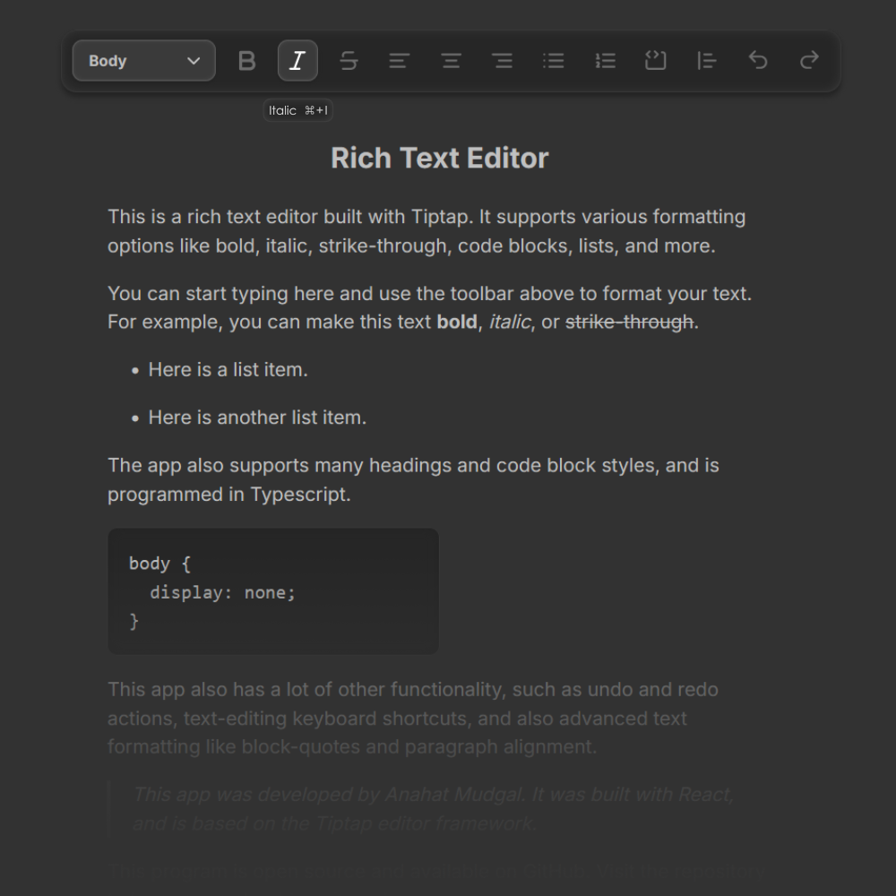

# Rich Text Editor

## 📝 About the app

This is a simple rich text editor prototype for basic text-editing in the browser, developed with React.
It supports various formatting options like bold, italic, strike-through, code blocks, lists, and more. It is built on the TipTap editor framework.

## 🚀 Features

- **Browser app** allowing you to use it on Windows, macOS, and Linux, easily usable in the browser.
- **Lightweight** minimalist user inserface with a simple UI and feature-set, so you can edit text quickly.
- **Advanced Text Formatting** including bold, italic, strikethrough, text-align, ordered and unordered lists, code blocks, block quotes, undo, and redo.
- **Keyboard Shortcuts** for commoon text editing actions, like bold, italic, underline, undo, redo. etc.

## 🛠️ Technologies Used

- **Vite**: Next Generation Frontend Tooling
- **React**: A JavaScript library for building user interfaces
- **TypeScript**: Typed JavaScript at Any Scale

## 👩‍💻 Developer

_Created by **[Anahat Mudgal](https://www.AnahatMudgal.com)**._
See the app [website page](https://www.AnahatMudgal.com/development/rich-text-editor).

## 💻 Screenshot

|  |
| :-----------------------------------------------------------: |
